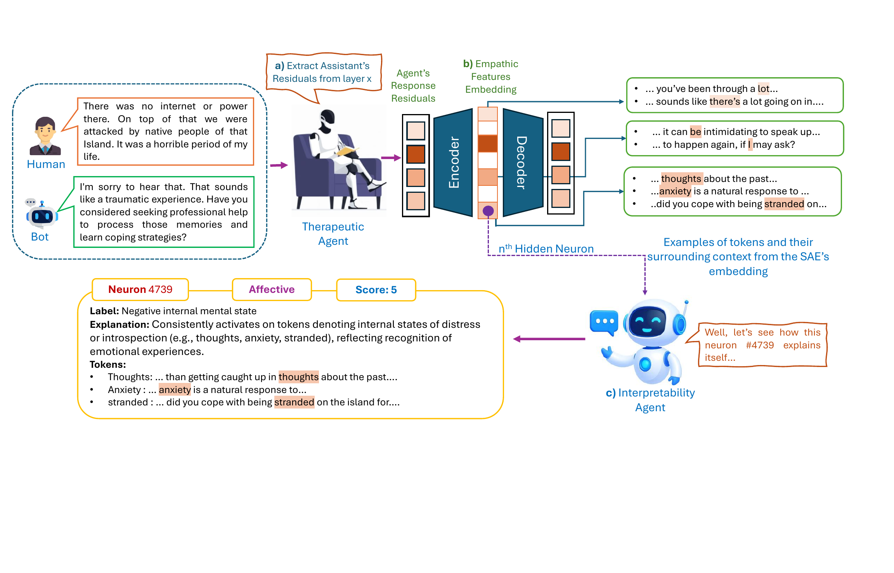

<div align="center">

# M-AIDE

### Mechanistic Agentic Interpretability for Decoding Empathy in Language Models  
**IVCNZ 2025 — Official Repository**
</div>


<p align="center">
  <br>
  <em>Figure 1 — Overview of the M-AIDE Framework.</em>
</p>

## Overview
**M-AIDE** introduces a mechanistic agent-based framework for interpreting empathy-related internal representations in large language models (LLMs).
It consists of:
- **Therapeutic Agent**
- **Empathy Feature Discovery (EFD) agent**: Disentangles internal layer activations of the theraputic agent into structured representations that aligh with human-defined empathy dimensions. It defines latent empathy-relevant features inside the model and maps them to interpretable activation patterns across the network.  
- **Interpretability Agent**: Automatically labels the discovered empathy features by anlayzing each feature's associated tokens and their surrounding contextual patterns.
## Release
- [17/11/2024] Base code implementation released.
- [6/11/2024] Installation guide and requirements added. The code for training EFD agent and interpretability agent will be released soon.

  
## Installation
To set up the repository on your local machine:

1. Clone the repository:
```
   git clone https://github.com/ai-voyage/M-AIDE.git
   cd M-AIDE
```
  2. Create a virtual environment and install dependencies
```
   conda create -n your_env_name python=3.10
   conda activate your_env_name
```
 3. Install dependencies
```
  pip install -r requirements.txt
```


## Usage
1. Data Preparation:
   - Download the dataset available at: [E-THER: A Multimodal Dataset for Empathic AI -- Towards Emotional Mismatch Awareness](https://arxiv.org/abs/2509.02100)
   - Download the therapeutic agent from: [E-THER: A Multimodal Dataset for Empathic AI](https://arxiv.org/abs/2509.02100)
2. Extract Activations:
   - Run the extraction script:
```bash
python exract_activations.py
python merge_batch_activations.py
 ```
**Note:** Use these activations to train the EFD agent.

3. Train EFD Agent:
```bash
python train_EFD_agent.py
 ```
**Note:** The EFD Agent uses the Sparse Autoencoder (SAE) library from  
[GitHub: ai-safety-foundation/sparse_autoencoder](https://github.com/ai-safety-foundation/sparse_autoencoder.git).

4. Run the interpretability agent to label empathy features from the dictionary.
```bash
python interpretability_agent.py
 ```

### Citation

if you use M-AIDE in your work, please cite:

```bibtext
@inproceedings{Mirnateghi2025mide,
title={M-AIDE: Mechanistic Agentic Interpretability for Decoding Empathy in Language Models},
  author={Nima Mirnateghi, Sharjeel Tahir, Syed Mohammed Shamsul, Syed Afaq Ali Shah},
  booktitle={2025 40th International Conference on Image and Vision Computing New Zealand (IVCNZ)},
  year={2025},
  note={To appear}
}
